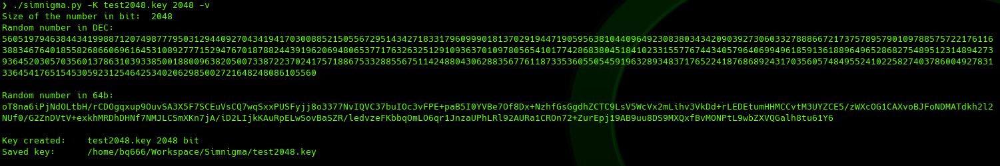
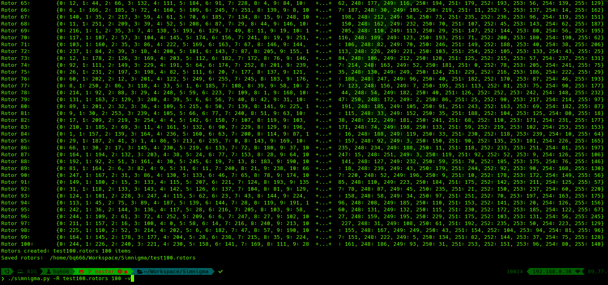
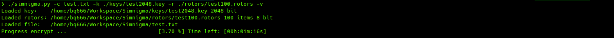
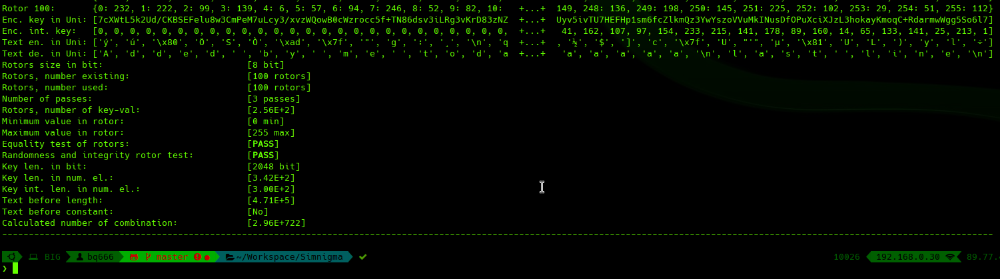
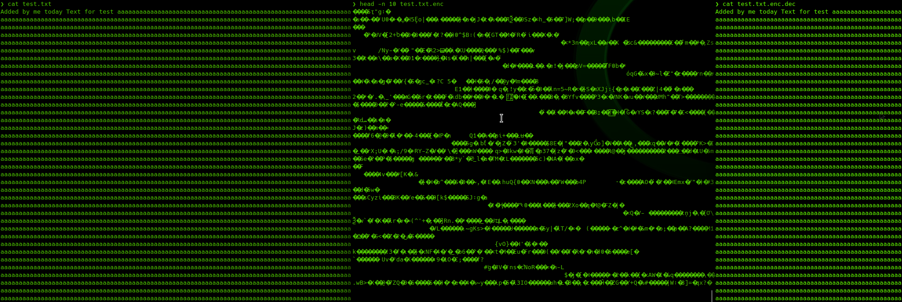

# Project Title

Enigma on steroids

## Getting Started

These instructions will get you a copy of the project up and running on your local machine for development and testing purposes. See deployment for notes on how to deploy the project on a live system.

```
Simple programme for encrypts and decrypts files.
Usage:      simnigma -c [file of files, you can use reg.]  
                Encryption the file (default key will be used the last created in the keys directory,
                the drums will be loaded with all the last ones created in the rotors directory)  
            simnigma -d [file of files, you can use reg.]
                Decryption the file (default are the same as with encryption)
            simnigma -c [file] -k [file or key name in dictionary keys]  
                Encryption with the indicated key
            simnigma -d [file] -k [file or key name in dictionary keys]  
                Decryption with the indicated key
            simnigma -c [file] -k [file] -r [first rotor file, or name in dictionary rotors]
                Encryption with the indicated key and indicated rotors and their number
            simnigma -d [file] -k [file] -r [first rotor file, or name in dictionary rotors]
                Decryption with the indicated key and indicated rotors and their number
            
            simnigma -K [name], [size]      Create key, size in bits. 
            simnigma -R [name], [number]    Create rotors, name only common part, number of created rotors
            
            simnigma -v --verbose           Show all progress
            simnigma -s --silent            If you wont to encrypt text directly from keybord or if you decript txt file, 
                                            use this option if you wont only read mesages without save files
            
            simnigma -h --help              Display this help and exit
            simnigma -V --version           Output version information and exit
            simnigma -s --silent            Encrypt only from screen and Decrypt only on screen
            # todo simnigma -t --tests      Run tests encrypt and decrypt
            # todo simnigma -rsa            Lock and anlock with rsa keys
            
Examples:   
			
More examples:
            simnigma.py -K your_key_name 2048 
                First you need to create a random key, 2048 it is size in bit. The Key will be saved in /keys diroctory of simnigma 
            simnigma.py -R your_rotors_name 20 
                Then you have to create a random 8-bit rotors, 8bit is the default setting for files, 
                20 is the number of rotors 
            simnigma.py -c some_file.txt [-k your_key_name] [-r your_rotors_name] 
                Now you can encrypt any file or files if you use reg. [for example *], encrypted files
                will be updated .enc. You can also use a different key or rotors if you insert the -k or -r option.
                By default, the most recently created keys and rotors are loaded from the keys and rotors 
                catalogs from the simnigma.py directory or if you are working on linux and connect USB than key and rotors
                will be loaded from pendrive.
            simnigma.py -d some_file.txt.enc [-k your_key_name] [-r your_rotors_name] 
                And last you can decrypt file or files, remember that you must use the same rotors and keys as
                 you use to encrypt, what is logically

            simnigma.py -K your_key_name.key key will be saved in current directory 


```

# Screenshots








### Prerequisites

What things you need to install the software and how to install them

```
Give examples
```

### Installing

A step by step series of examples that tell you have to get a development env running

Say what the step will be

```
chmode + x enigma
Give the example
```

And repeat

```
until finished
```

End with an example of getting some data out of the system or using it for a little demo

## Running the tests

Explain how to run the automated tests for this system

### Break down into end to end tests

Explain what these tests test and why

```
Give an example
```

### And coding style tests

Explain what these tests test and why

```
Give an example
```

## Deployment

Add additional notes about how to deploy this on a live system

## Built With

* [Dropwizard](http://www.dropwizard.io/1.0.2/docs/) - The web framework used
* [Maven](https://maven.apache.org/) - Dependency Management
* [ROME](https://rometools.github.io/rome/) - Used to generate RSS Feeds

## Contributing

Please read [CONTRIBUTING.md](https://gist.github.com/PurpleBooth/b24679402957c63ec426) for details on our code of conduct, and the process for submitting pull requests to us.

## Versioning

We use [SemVer](http://semver.org/) for versioning. For the versions available, see the [tags on this repository](https://github.com/your/project/tags). 

## Authors

* **Billie Thompson** - *Initial work* - [PurpleBooth](https://github.com/PurpleBooth)

See also the list of [contributors](https://github.com/your/project/contributors) who participated in this project.

## License

This project is licensed under the MIT License - see the [LICENSE.md](LICENSE.md) file for details

## Acknowledgments

* Hat tip to anyone who's code was used
* Inspiration
* etc

